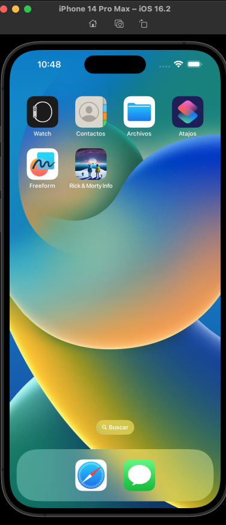
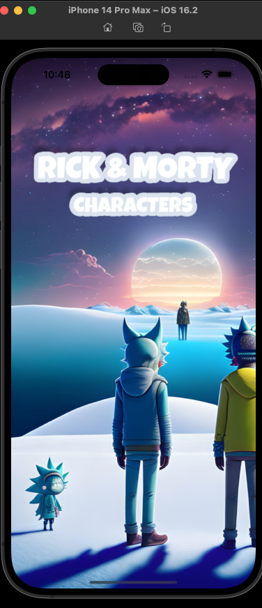
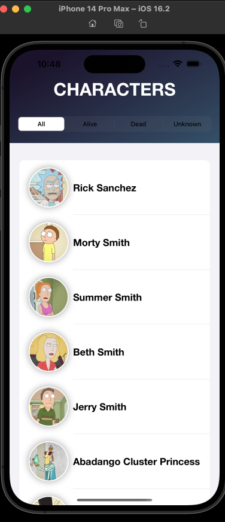
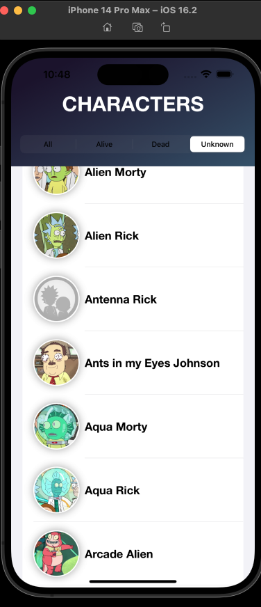
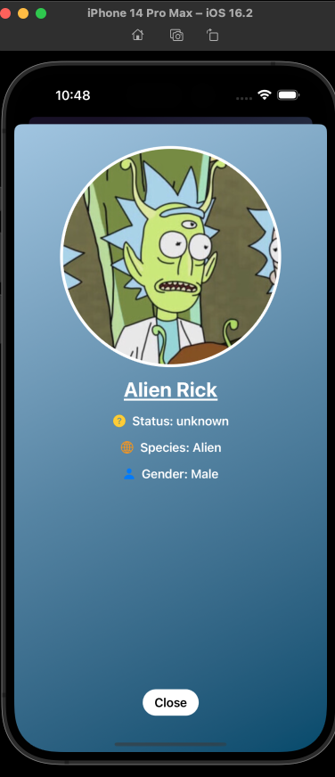

# RickAndMortyCharacter
Rick and Morty Character App

The Rick and Morty Character app is a mobile application built using SwiftUI and the VIPER architecture. 
The application allows users to view a list of characters from the popular animated television series, Rick and Morty. 
The list can be filtered based on the character's status, such as "Alive", "Dead", or "Unknown".

The application includes the following classes:

    NetworkManager: A class that performs network requests and returns the response in a Result object.
    ListCharacterInteractor: A class that provides methods for fetching a list of characters and filtering them by their status. It uses the NetworkManager to make network requests.
    ListCharacterPresenter: A class that handles the business logic for displaying a list of characters. It uses the ListCharacterInteractor to fetch data and provides methods for loading more characters and filtering them by their status.
    DetailPresenter: A class that handles the business logic for displaying the details of a character. It uses the DetailInteractor to fetch data and provides a method for mapping the entity response to the view model.
    Endpoint: A struct that contains the endpoints for the Rick and Morty API.
    ListCharacterView: A SwiftUI view that displays a list of characters and provides a segmented control for filtering them. It uses the ListCharacterPresenter to handle the business logic.
    DetailViewModel: A struct that contains the details of a character, including their name, status, species, gender, and image.
    CharacterViewModel: A struct that contains the basic information of a character, including their ID, name, and image URL.
    CharacterResponseEntity: A struct that contains the response data from the Rick and Morty API.
    DetailView: A SwiftUI view that displays the details of a character. It uses the DetailPresenter to handle the business logic and displays the information using various UI components.
    DetailInteractor: A class that provides a method for fetching the details of a character using the NetworkManager to make network requests.
    MapperDetailCharacterViewModel: A class that maps the response entity from the API to a DetailViewModel.
    DetailCharacterEntity: A struct that contains the response data for a single character from the Rick and Morty API.
    MapperDetailCharacterViewModel: A struct that provides a method for mapping a DetailCharacterEntity to a DetailCharacterViewModel.
    CharacterViewModel: A struct that contains the basic information of a character, including their ID, name, and image URL.
    DetailCharacterViewModel: A struct that contains the details of a character, including their name, status, species, gender, and image.
    MapperCharacterViewModel: A struct that provides a method for mapping a CharacterModel to a CharacterViewModel.
    
    
    

In summary, the application fetches data from the Rick and Morty API, displays a list of characters,
and allows the user to filter them by their status. When the user taps on a character, 
the application displays their details in a separate view.

The application uses the VIPER architecture, but the router component has been omitted since the application only has three views.
The app also includes unit tests for the NetworkManager class.

